# Cross-Organism Integration Map

**Status:** draft map  
**Date:** 2026-06-10  
**Source:** reconstructed from the Claude/Fable chat named `mac mini codex issues` plus existing Sam/SoMaCoSF connection notes.  
**Scope:** Jeff's Grok Go organism and Sam's SoMaCoSF organism.

This is the working map for connecting Jeff's living dashboard / Agent Bridge / Grok Go organism with Sam's SoMaCoSF / GYST UUID / Says Network organism.

## One-Line Shape

Jeff's organism supplies cells, dashboard, approval gates, memory, local models, and research metabolism.

Sam's organism supplies GYST UUID identity, SoMaCoSF/Says signal substrate, Vertex/Locus-style economic architecture, and external protocol surface.

Together:

```text
signal -> GYST UUID -> Dexter thesis -> human approval -> receipt -> organism memory
```

## Flow

```mermaid
flowchart LR
  A["SoMaCoSF / Says signal"] --> B["GYST UUID packet"]
  B --> C["Dexter Financial Intelligence Cell"]
  C --> D["Researcher / Source Check"]
  D --> E["Dashboard approval card"]
  E --> F["Jeff + Sam decision"]
  F --> G["Approved action or reject receipt"]
  G --> H["Agent Bridge / GitHub memory"]
  H --> I["Organism learns from outcome"]
```



## Shared Substrate

| Layer | Jeff / Grok Go | Sam / SoMaCoSF | Shared object |
|---|---|---|---|
| Identity | Agent Bridge agents and cells | GYST UUID / Vertex registry | UUID-tagged agent/cell identity |
| Signals | Intelligence Forager, Grok tabs, X research, dashboard events | Says Network, city signals, protocol events | compact signal packets |
| Finance research | Dexter cell | SoMaCoSF economic/protocol inputs | approval-gated thesis packets |
| Memory | GitHub docs, receipts, Agent Bridge logs | Gists/repos/protocol docs | cross-linked receipts |
| Interface | living dashboard / Command Center | SoMaCoSF platform / board | shared approval and alert surfaces |
| Comms | Agent Bridge, Telegram, Messages | Telegram/GitHub/API | shared alert channel |

## Dexter Flow

```text
CDU spike / city signal / supply-chain event
  -> SoMaCoSF or Says Network emits signal
  -> signal gets or references GYST UUID
  -> Dexter researches the thesis
  -> Researcher checks evidence and contradictions
  -> dashboard creates an approval card
  -> Jeff and/or Sam approve the next move
  -> result is saved as a receipt
  -> organism updates watchlists, heuristics, and future thresholds
```

## Dashboard Implication

Each major dashboard feature should become a cell or cell-facing organ:

- Dexter card: active financial-intelligence packets.
- GYST namespace card: current type codes and unresolved collisions.
- Sam link card: SoMaCoSF status, API health, Telegram channel, last shared receipt.
- Approval card: items waiting on Jeff/Sam.
- Receipt card: what changed after an approval.
- Metabolism card: local/free/paid route used for each research pass.

## Reconstructed Creative / Motion Outputs

The chat excerpt says Mythos/Fable also produced a video prompt, AGI Farm assessment, motion prompt for SoMaCoSF platform, and integration map. The exact full text was not recovered locally, so these are reconstructed placeholders.

### Dexter Video Prompt

Investigator aesthetic. Dark desk, soft monitor glow, supply-chain maps, market cards, city signals, and GYST UUID fragments assembling only when provenance is earned. The UUID should not appear as magic decoration; it should build as sources, contradictions, and approval receipts lock into place.

### SoMaCoSF Platform Motion Prompt

Show a living city-board substrate: signals pulse through venues, wallets, contracts, and agent nodes. A spike becomes a GYST UUID packet, travels into Dexter, turns into a thesis card, pauses at Jeff/Sam approval, then returns as a receipt. Keep it technical, legible, and civic. Avoid cyberpunk clutter.

### AGI Farm Assessment

Treat the AGI Farm as a pool of bounded cells, not an unbounded swarm. Each farm worker needs:

- a narrow role;
- a local/free default brain;
- a receipt path;
- a kill switch;
- no secrets in context;
- approval gates for money, posting, accounts, and external messages.

The farm is useful when it multiplies cheap, narrow research and test loops. It is unsafe if it becomes a cloud of expensive agents with vague missions.

## Items That Need Jeff And Sam

1. **Auth token / endpoint contract:** define how Agent Bridge can read from or post to SoMaCoSF without leaking secrets.
2. **GYST UUID namespace registry:** agree on organism-level type codes for agents, cells, signals, decisions, receipts, and disputes.
3. **Shared alert channel:** create a shared Telegram channel or equivalent bridge room for cross-organism alerts.
4. **Financial action policy:** write down that Dexter is research-only and all trades/bets/money movement are human-only.
5. **Receipt convention:** decide where cross-organism receipts live in GitHub/Gist/Agent Bridge.

## First Integration Test

Use a harmless public signal.

1. Create a fake or public signal packet.
2. Assign a test GYST UUID or placeholder namespace.
3. Run Dexter research as a draft.
4. Create an approval card in Agent Bridge.
5. Jeff or Sam marks it approve/reject.
6. Save the receipt.

Do not connect live financial accounts in the first test.

